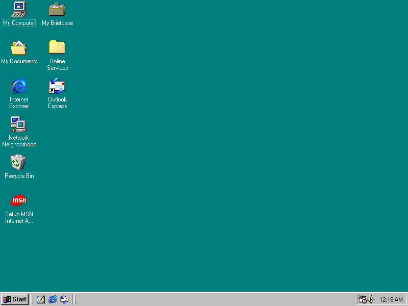

# V9x Remote Agent

Remote control for Windows 9x development guests, built for AI-driven
development and debugging. A 141 KB runtime-free agent runs inside Windows
95/98/Me (typically an 86Box VM). A PowerShell CLI and an MCP server on the
host let a developer, or an AI coding agent working on their behalf, build
software on a modern machine, push it into the guest, run it, capture output
and screenshots, and reboot the guest with cryptographic-grade proof that the
reboot actually happened.



*The screenshot above was taken by the agent itself:
`v9xctl.ps1 screenshot -Destination desktop.bmp`.*

## Why

Retro Windows development has a brutal inner loop: build on a modern host,
copy into the VM by hand, click around, squint at the screen, reboot, repeat.
This project turns that into one bounded command per step, with JSON output
and deterministic exit codes, which is exactly the interface an AI coding
agent needs. Point Claude Code (or any MCP client) at a Windows 98 VM and it
can compile, deploy, execute, read stdout, look at the screen, and prove a
clean reboot without a human touching the emulator.

## What it does

- Direct Win32 and `COMMAND.COM` shell execution with streamed stdout/stderr,
  byte limits, timeouts, cancellation, and deterministic exit codes
- CRC32-verified transactional file upload/download (`.PART` staging plus
  rollback backups) and recursive host-to-guest tree push
- Proven reboots: a persisted resume token plus a boot counter mean "the guest
  rebooted" is verified, never assumed
- Desktop-ready polling and 24-bit BMP screenshot capture
- Mouse and keyboard injection (move, click, drag, wheel, hotkeys, typed text)
  so an agent can drive dialogs and installers the UI only exposes visually
- A small, versioned, fragmentation-safe TCP protocol (see
  [docs/protocol.md](docs/protocol.md)); the guest agent is a single 141 KB
  EXE with audited imports and no runtime dependencies
- Optional IPv4 binding, port, and client allowlist for real retro hardware
  on an isolated network ([docs/physical-machine.md](docs/physical-machine.md))

## Quickstart

| You have | Start here |
|---|---|
| Nothing set up yet | [docs/quickstart-86box.md](docs/quickstart-86box.md): 86Box + your own Windows 98 media + the install ISO |
| A working Win98 VM in 86Box | Three steps below |
| An AI coding agent to hook up | [AGENTS.md](AGENTS.md) and [mcp/README.md](mcp/README.md) |
| Open Watcom and curiosity | The Build section below |

### I already have a Windows 98 VM

1. Give the VM an NE2000 PnP NIC on SLiRP and forward TCP 9869, by adding to
   the profile's `86box.cfg` (while 86Box is closed):

   ```ini
   [Network]
   net_01_card = ne2kpnp
   net_01_net_type = slirp

   [SLiRP Port Forwarding #1]
   0_protocol = tcp
   0_external = 9869
   0_internal = 9869
   ```

2. Get `V9XREMOTE.ISO` (from the release download, or build it yourself with
   `.\scripts\make-install-media.ps1`), attach it as a CD image in 86Box,
   then in the guest run `D:\INSTALL.BAT` and reboot Windows.

3. From the host:

   ```powershell
   .\scripts\v9xctl.ps1 ping
   ```

   `{"Success":true,...}` means an AI agent can now drive the guest. Read
   [docs/ai-workflows.md](docs/ai-workflows.md) for the full loop.

## Host requirements

- The PowerShell CLI (`scripts\v9xctl.ps1`) needs Windows PowerShell 5.1, so
  a Windows host.
- The MCP server (`mcp\v9x_mcp.py`) needs only Python 3.9+ and works on
  Windows, macOS, and Linux; 86Box runs on all three.
- Building the guest agent from source needs Open Watcom (see Build below);
  release downloads include a prebuilt, import-audited `V9XAGNT.EXE` so most
  users never need a compiler.

## Host usage

```powershell
.\scripts\v9xctl.ps1 ping
.\scripts\v9xctl.ps1 info -Json
.\scripts\v9xctl.ps1 shell -Command "VER"
.\scripts\v9xctl.ps1 exec -Application C:\V9XREMOTE\TEST.EXE -Arguments "/quiet" -WorkingDirectory C:\V9XREMOTE
.\scripts\v9xctl.ps1 stat -Path C:\V9XREMOTE -Json
.\scripts\v9xctl.ps1 mkdir -Path C:\V9XREMOTE\JOBS\demo
.\scripts\v9xctl.ps1 put -Source .\TEST.EXE -Destination C:\V9XREMOTE\JOBS\demo\TEST.EXE
.\scripts\v9xctl.ps1 get -Source C:\V9XREMOTE\AGENT.LOG -Destination .\agent.log
.\scripts\v9xctl.ps1 push-tree -Source .\package -Destination C:\V9XREMOTE\JOBS\demo
.\scripts\v9xctl.ps1 reboot -JobId demo-reboot -WaitSeconds 180 -Json
.\scripts\v9xctl.ps1 wait-desktop -WaitSeconds 120
.\scripts\v9xctl.ps1 screenshot -Destination .\desktop.bmp -Json
```

Exit code 0 means success. Transport and protocol failures use 20 to 23;
process creation, unexpected exit, timeout, and cancellation use 30 to 33.
The full verb and exit-code reference is [docs/host-cli.md](docs/host-cli.md).

## Build

Only needed if you want to modify the guest agent; releases ship a prebuilt
package. Open Watcom must be available through `WATCOM` or at `C:\WATCOM`
(64-bit host tools, `binnt64`).

```powershell
.\scripts\build-guest.ps1 -BuildId dev-001
.\scripts\build-host-tests.ps1
.\scripts\make-install-media.ps1 -Validate
```

The guest package is written to `build\install`, which always holds the most
recently built version, and the install CD image to `build\V9XREMOTE.ISO`.
The build audits the produced PE (allowed DLLs, required imports, subsystem
4.0) and stamps the package version from
[include/v9xremote/version.h](include/v9xremote/version.h).

For a physical Windows 9x machine, use the same package and configure
`C:\V9XREMOTE\AGENT.INI` as described in
[docs/physical-machine.md](docs/physical-machine.md).

## Safety

Protocol v1 is intentionally unauthenticated: anyone who can reach TCP 9869
has full control of the guest. Keep 86Box in SLiRP/NAT mode, protect the
forwarded port with the host firewall, and never bridge the guest NIC or
expose the listener to a LAN or the Internet. Details in
[SECURITY.md](SECURITY.md).

## Documentation

- [docs/quickstart-86box.md](docs/quickstart-86box.md): zero-to-working 86Box setup
- [docs/ai-workflows.md](docs/ai-workflows.md): the AI development loop, annotated
- [AGENTS.md](AGENTS.md): operating manual for AI coding agents
- [mcp/README.md](mcp/README.md): MCP server setup and tool reference
- [docs/host-cli.md](docs/host-cli.md): every v9xctl verb and exit code
- [docs/guest-agent.md](docs/guest-agent.md): guest runtime behaviour and AGENT.INI
- [docs/protocol.md](docs/protocol.md): the wire protocol
- [docs/physical-machine.md](docs/physical-machine.md): real retro hardware
- [docs/design.md](docs/design.md): the original staged design document
- [CHANGELOG.md](CHANGELOG.md)

## Windows licensing

This project contains and distributes no Microsoft software. You must supply
your own Windows 95/98/Me installation media and license for the guest.

## License

BSD 2-Clause. See [LICENSE](LICENSE).
